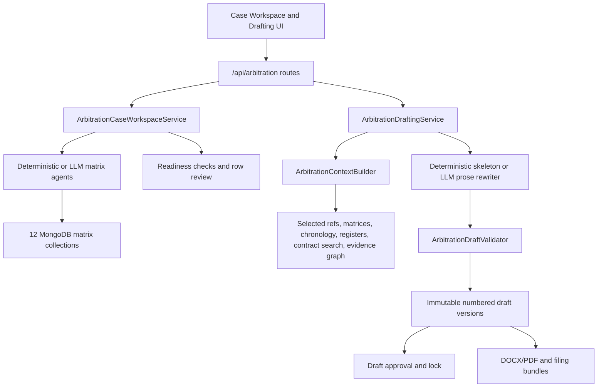
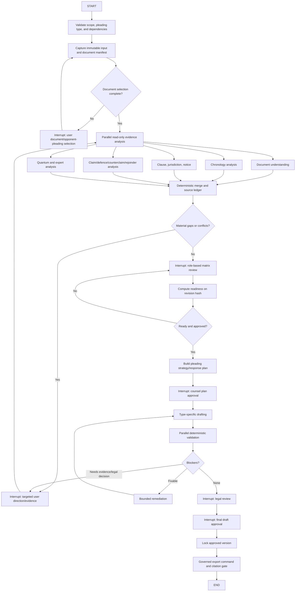

# Arbitration Pleadings Workflow Audit and LangGraph Implementation Plan

> Implementation status (verified 2026-07-22): P0-01 through P0-08 are implemented locally behind fail-safe v2 rollout controls; no Phase 0 code item is currently open, but production-like migration and authorization acceptance remain pending. The next functional cleanup has also started: authoritative paragraph responses now materialize server-owned, reviewable, read-only defence/rejoinder projections, closing new draft-bound duplicate writes. Historical ambiguous rows still require a conservative audit/backfill. See `ARBITRATION_LANGGRAPH_IMPLEMENTATION_PROGRESS.md` and `docs/architecture/arbitration_langgraph_operations_runbook.md`.
>
> Phase 2 status (implemented 2026-07-22; production-like acceptance pending): the official graph skeleton, minimal typed checkpoints, durable gates/APIs, checkpoint redaction/retention, UI polling/timeline, pre-side-effect CAS enforcement, idempotent and cumulative checkpoint recovery, passive cancellation checkpointing, recoverable checkpoint-sync markers, and immutable-snapshot-bound v2 fallback are implemented and locally tested. The acceptance requirement to kill/restart at every graph node and human gate has not yet been completed against production MongoDB; only the document-selection restart path has production evidence.

**Audit date:** 2026-07-21
**Scope:** Statement of Claim (SoC), Statement of Defence (SoD), Counterclaim, and Rejoinder
**Repository:** `C:\SaaS\projectDMS`
**Status:** Current-source audit and implementation recommendation; no production runtime or live LLM was exercised

## 1. Executive Summary

ContraClaim already has a substantial arbitration-pleadings subsystem. The active backend route is `/api/arbitration`, registered in `backend/rbac_backend/main.py`, and the active UI is provided by `ArbitrationCaseWorkspacePage.tsx` and `ArbitrationDraftingPage.tsx`. The subsystem supports case intake, twelve preparation matrices, deterministic and selected LLM-assisted agents, matrix review, readiness checks, source-ledger construction, type-specific drafting, validation, versioning, approval, audit events, individual pleading export, and filing bundles.

The strongest existing design is the source-ledger contract: generators use stable `S#` citations, missing support is made visible as `[Evidence required]`, versions retain their source ledger, LLM matrix output citing unknown source IDs is rejected, and the LLM prose rewriter must preserve the deterministic draft's citation tokens and missing-evidence markers.

However, the present workflow is not yet safe to treat as a fully controlled end-to-end legal preparation process. Several normal API/UI paths can bypass the intended human controls:

1. Manually created matrix rows default to `approved` / `ready` / `verified` in the UI, and an edit-permission path can mark any row ready without using the approval endpoint.
2. Deterministic agent requests accept an unconstrained `options.auto_approve`, although agent execution requires generate permission rather than approve permission.
3. `prepare_draft_from_case()` copies all document, clause, and claim rows, not only approved rows, into draft-selected references and claim heads. Selected references then enter the ledger without a fresh provenance/approval check.
4. Generation recomputes readiness blockers but does not require the explicit readiness-approval receipt created by `approve-readiness`.
5. A standalone draft can be approved despite never passing case readiness; the validator emits only a warning.
6. Individual pleading export and filing-bundle export do not require draft approval, readiness approval, or a passing citation audit. Bundles include the latest version of every linked draft, including unapproved drafts.
7. The rejoinder new-matter field is semantically inverted: the LLM sets `tribunal_permission_required=true`, while readiness and validation block only when that flag is false. There is no separate `permission_obtained` record.
8. Section regeneration creates a latest version containing only the regenerated section rather than merging it into the previous complete version. It is also recorded as a full-draft run.

The current agent orchestrator is a sequential Python loop, not LangGraph. It has no durable checkpoint, pause/resume, cancellation, node-level retry, conditional pleading-specific routing, or parallel evidence analysis. Its queued execution uses an in-process `asyncio.Queue`; process restart loses work, and job-level retry is usually ineffective because agent/export workers catch exceptions and return a failed record instead of raising to the job processor.

The repository now contains an official in-process LangGraph implementation for **letter drafting**, not arbitration drafting. It uses `StateGraph`, MongoDB checkpoints, `interrupt()`, poll/resume/cancel APIs, server-side engine selection, immutable snapshots, an effect ledger, and a force-v2 fallback. This materially improves feasibility for arbitration adoption because the dependency, deployment shape, security approach, and operational patterns already exist. It is not a drop-in arbitration implementation: several letter graph nodes are currently orchestration markers/no-ops, and the proven v2 letter service still executes the domain pipeline after human gates.

### Recommendation

Adopt official LangGraph **in process inside the main backend** as the durable arbitration workflow coordinator, while retaining the current arbitration services, agents, generator, validator, exporter, and repository behind a versioned `ArbitrationWorkflowEngine` interface. Do not promote the experimental `services/langgraph` sidecar and do not rewrite mature domain logic into graph nodes at once.

Before starting the graph migration, complete a containment phase that closes the approval, provenance, section-regeneration, new-matter, and export bypasses. Then introduce immutable snapshots, an idempotent effect ledger, typed graph state, durable MongoDB checkpoints, explicit human interrupts, type-specific routing, parallel read-only evidence analysis, bounded retries, shadow comparison, tenant/project canaries, and an explicit `arbitration_v2` fallback.

## 2. Audit Method and Evidence

The audit used the existing Graphify graph for orientation, then validated material conclusions against current source. A prior architecture note was treated as non-authoritative where current code differed.

### 2.1 Primary source locations inspected

- API registration and routes: `backend/rbac_backend/main.py`, `backend/rbac_backend/routers/arbitration_drafting.py`
- Domain models: `backend/rbac_backend/models/arbitration_drafting.py`
- Case, matrix, review, readiness, agent-run, citation-audit, and bundle logic: `backend/rbac_backend/services/arbitration_drafting/case_workspace.py`
- Draft lifecycle: `backend/rbac_backend/services/arbitration_drafting/service.py`
- Evidence/source ledger: `backend/rbac_backend/services/arbitration_drafting/context.py`
- Deterministic and LLM generation: `generator.py`, `llm_generator.py`
- Deterministic and LLM matrix agents: `agents/deterministic.py`, `agents/llm.py`, `agents/__init__.py`
- Validation and export: `validator.py`, `exporter.py`
- Persistence and indexes: `repository.py`, `backend/rbac_backend/core/database.py`
- UI and API clients: `client/src/pages/ArbitrationCaseWorkspacePage.tsx`, `client/src/pages/ArbitrationDraftingPage.tsx`, `client/src/services/arbitration-cases-api.ts`, `client/src/services/arbitration-drafting-api.ts`
- Official LangGraph reference: `backend/rbac_backend/services/letter_drafting/langgraph_engine.py`, `backend/rbac_backend/services/letter_drafting/engines/policy.py`, `backend/rbac_backend/routers/letter_drafting.py`
- Experimental sidecar: `services/langgraph/orchestrator.py`

### 2.2 Verification performed during this audit

- Arbitration backend tests: **64 passed**.
- Arbitration HTTP-isolation tests: **8 skipped** because the local TestClient/app fixture was unavailable; they did not fail assertions.
- Focused arbitration UI tests: **9 passed across 2 files**.
- Official letter LangGraph runtime tests could not collect in the selected local Python environment because `langgraph.checkpoint.mongodb` was not installed, even though `langgraph-checkpoint-mongodb==0.4.0` is pinned in requirements. Dependency parity is therefore an explicit deployment gate.
- Live MongoDB, Qdrant, S3, Redis, production workers, authenticated browser flows, and live model calls were not tested.

## 3. Present System Topology

This is a service-orchestrated workflow. There is no arbitration `StateGraph`, checkpoint collection, graph thread ID, interrupt token, resume command, or engine selector.

## 4. Present End-to-End Workflow

### 4.1 Stage 1 — Case intake

The recommended path begins at `/arbitration/cases/new`. The user supplies:

| Input group | Present fields |
|---|---|
| Scope | Organization inferred/selected, project, optional contract |
| Case identity | Title, case reference, claimant/respondent/both/neutral perspective |
| Tribunal and procedure | Tribunal details, institutional rules, seat, venue, language |
| Applicable law | Governing law and arbitration clause/source |
| Case narrative | Case summary |

The case is stored in `arbitration_cases` with status `matrix_preparation`. Case status is not itself a state machine: generic case update can set status, and downstream functions do not consistently enforce a preceding status transition.

### 4.2 Stage 2 — Document selection and evidence preparation

There are three overlapping selection mechanisms:

1. **Case document index.** The document-indexing agent reads up to a configured number of scoped documents and creates document-index rows with title, date, reference, sender/recipient, type, relevance note, source link, risk flags, and exhibit number. Human users can also create rows manually.
2. **Prepare from case.** When a draft is created from the case dashboard, `prepare_draft_from_case()` copies document-index and clause-matrix rows into `arbitration_selected_references`, and claim-matrix rows into `arbitration_claim_heads`.
3. **Draft evidence search.** The draft page performs a regex search over scoped documents and clause/vector records. The user can add/remove selected references and exclude project-register rows from the next generated ledger.

The draft-create form can also add a manually typed evidence note and manual facts. There is no mandatory document preview, page selection, opponent-pleading version selection, or immutable document manifest at intake.

### 4.3 Stage 3 — Agent-assisted matrix preparation

The case dashboard exposes individual agents and a queued `orchestrator`. Agent mode is deterministic by default or LLM when selected/configured.

The deterministic orchestrator sequence is:

1. `document-indexing`
2. `chronology-builder-adapter`
3. `clause-interpretation`
4. `jurisdiction`
5. `claim-identification`
6. `quantum`
7. `delay-expert`
8. `notice-compliance`
9. `issue-framing`

This sequence is the same regardless of pleading type. It does not include `document-understanding`, `defence-analysis`, `counterclaim-setoff`, `rejoinder-reply`, `review-consistency`, or `legal-guardrail`.

The following matrices are first-class MongoDB collections:

| Matrix | Main source/producer | Intended role |
|---|---|---|
| Document index | Scoped documents, manual rows | Exhibit identity and filing provenance |
| Chronology matrix | Verified `matter_chronology_events` | Ordered facts, responsibility, impact, links |
| Clause matrix | Contract clause records or case clause | Entitlement/obligation and clause risk |
| Issue matrix | Claims and dispute templates | Tribunal-facing issues |
| Claim matrix | Claims register | Entitlement, facts, causation, amount, relief |
| Defence matrix | LLM defence analysis or manual entry | Admission/denial, reason, positive case, quantum objection |
| Counterclaim matrix | Manual entry; current agent is review-only | Breach, facts, causation, amount, relief |
| Rejoinder matrix | LLM with imported SoD paragraphs or manual entry | Claimant replies and new-matter flags |
| Quantum annexures | Claim/variation/IPC sources and calculations | Principal, interest, rollup, cost/event links |
| Notice compliance | Notice-like indexed documents | Notice dates, requirement, compliance risk |
| Jurisdiction matrix | Jurisdiction agent/manual | Limitation, pre-arbitration steps, clause scope, timetable |
| Expert alignment | Delay/quantum claims | Concurrency and calculation alignment |

#### Agent grounding controls

- LLM prompts contain scoped source rows keyed by ID.
- Output rows citing an unknown source ID are rejected.
- LLM-created rows always start as `needs_review`; LLM mode ignores `auto_approve`.
- Amounts, clause excerpts, and identifying metadata are copied from sources in code for the implemented LLM handlers.
- Deterministic insertion is idempotent only by an agent-specific uniqueness query; existing rows are skipped rather than refreshed when a source changes.

#### Current orchestration limitations

- Agents run sequentially even when document, chronology, clause, jurisdiction, notice, and quantum analysis could be read-only parallel branches.
- The orchestrator catches an exception into its result and continues no further only when the outer catch fires; there is no node checkpoint or partial-resume position.
- `ArbitrationAgentRun.input_hash` hashes case ID, draft ID, agent type, and options, but not the source/matrix revisions actually analyzed.
- The input hash is recorded but not used to deduplicate a run.
- Re-running after source change skips rows already matching the uniqueness query, so matrix content can remain stale.

### 4.4 Stage 4 — Chronology and claim preparation

The chronology adapter selects verified central chronology events, or reviewable events only when review sources are explicitly allowed. It copies event date, description, document reference, responsible party, clause, impact, evidence, issue link, claim link, and pleading use into the chronology matrix.

Chronology is available to drafting through the source ledger, but it is not a mandatory readiness check. A case can pass the current readiness gate without an approved chronology row. The workflow also lacks a graph-level rule that every material factual paragraph or claim causation chain must be traceable through chronology event -> source document -> claim/issue.

Claim preparation is split between `arbitration_claim_matrix` and draft-level `arbitration_claim_heads`. `prepare_draft_from_case()` copies claim rows into claim heads, while the generator prefers matrix claim rows when available. This creates duplicated state and drift risk.

### 4.5 Stage 5 — Matrix review and readiness

The intended human review endpoint supports assign, comment, request changes, approve, and reject. Default required reviewer roles vary by matrix; for example, claim rows require legal and quantum, clauses require legal and contracts, and chronology requires delay review. Approval logs and task-board assignments are persisted.

Readiness recomputes checks for documents, clauses, issues, the pleading-specific matrix, quantum, notices, limitation, pre-arbitration steps, arbitration-clause scope, pleading timetable, expert alignment, and rejoinder new matter. Any `needs_*` or `blocked` state is a blocker.

`approve-readiness` requires arbitration approve permission and records the approver/time on the case. Draft generation and approval call `assert_case_ready_for_draft()`, but that method checks only the recomputed blockers. It does **not** require the case's readiness approval receipt or prove that the approval covered the current matrix revision set.

### 4.6 Stage 6 — Draft creation and pleading dependencies

The user can create a draft from a case workspace or use standalone SoC/SoD/Rejoinder/Counterclaim forms.

Common draft inputs include project/case link, party role, dispute type, title, tribunal, arbitration clause, governing law, relief, manual facts, amount, currency, interest rate, register inclusion, an initial evidence note, and an optional claim head.

Pleading dependency handling is as follows:

| Pleading | Present dependency handling |
|---|---|
| SoC | Claim, issue, clause, chronology, jurisdiction, quantum, notice, and expert rows; no prior pleading import |
| SoD | User pastes SoC text into a paragraph import endpoint; defence matrix can be generated separately from claim rows |
| Counterclaim | Reuses the SoC section structure under a Counterclaim title; counterclaim matrix is manual because the agent is a review-only stub |
| Rejoinder | User pastes SoD text; LLM rejoinder agent requires a `draft_id` with imported paragraphs, but the case dashboard does not send a draft ID |

The UI import sends pasted text but no `source_pleading_document_id`. The imported pleading is therefore not bound to a selected immutable document/version/hash. Import creates paragraph-response rows defaulted to `require_proof` and `[Evidence required]`.

There is no user-facing endpoint/UI to edit each `ArbitrationParagraphResponse` into admit/deny/reason/support. The `paragraph-responses/generate` endpoint currently calls full draft generation rather than updating paragraph-response records. Defence/rejoinder matrices and paragraph-response records consequently duplicate the same legal response concept without a reconciliation rule.

### 4.7 Stage 7 — Evidence retrieval and source-ledger construction

On generation or refresh, `ArbitrationContextBuilder` assembles:

1. Draft-selected references.
2. Case matrices: document, chronology, clause, issue, claim/defence/counterclaim/rejoinder, quantum, notice, jurisdiction, and expert alignment.
3. Project registers: claims, variations, IPCs, and bank guarantees, unless excluded.
4. Contract search results, limited to five.
5. Verified evidence-graph links; review-only links when explicitly requested.

Each ledger row receives a sequential `source_key`, citation/snippet, permitted uses, source origin, quality flags, evidence strength, and `source_hash`. The source hash includes source type, ID, citation, and snippet, but omits page numbers, approval status, and much metadata.

Approved matrix rows are normally filtered before direct case-matrix ingestion. That safeguard is weakened because `prepare_draft_from_case()` first copies unfiltered case rows to selected references, and selected references are always admitted to the ledger. A client can also add a reference typed as `document` or `clause` with user-supplied label/snippet without a server-side provenance lookup; it will be treated as selected.

Project register status filters include business-process statuses such as notified, under review, rejected, disputed, expired, and encashed. These may be useful facts, but they are not equivalent to evidentiary approval. They enter the ledger without per-row legal verification unless the user excludes them.

### 4.8 Stage 8 — Drafting

The default deterministic generator builds a type-specific, source-grounded skeleton. Optional LLM mode rewrites eligible deterministic sections into prose.

#### SoC and Counterclaim sections

Caption, index, introduction, parties, jurisdiction, factual background, legal claims, quantum, interest, costs, relief, verification/statement of truth, and annexures. Counterclaim uses the same structure with a Counterclaim caption.

#### SoD sections

Caption, overview, preliminary objections, paragraph-by-paragraph SoC response, respondent facts, legal defences, quantum challenge, interest/cost reply, counterclaim, relief, and annexures.

#### Rejoinder sections

Caption, scope, response to preliminary objections, paragraph-wise SoD reply, clarified facts, reply to legal defences, quantum reply, interest/cost reply, counterclaim reply, reaffirmed relief, and annexures.

The deterministic generator attaches source labels or `[Evidence required]`. The LLM prose layer rejects a rewritten section when it adds/drops citation tokens or drops missing-evidence markers. It does not code-verify invented party names or clause numbers; those are prompt rules, and the downstream validator checks citations, amounts, and dates but not all named entities or legal propositions.

Draft generation is synchronous in the request. A generation-run record is created, then context collection, model execution, validation, version insertion, run update, and draft update occur without a transaction or durable node checkpoint.

The generation input hash supports reuse of identical latest output. Section regeneration passes a section key into the normal generator, which filters the section list to one item. The newly inserted version therefore becomes a one-section latest version rather than a merged full pleading.

### 4.9 Stage 9 — Validation

Current approval blockers include:

- No ledger and no `[Evidence required]` marker.
- Citation to an unknown source key.
- Monetary amounts or date strings not found verbatim in source/draft text.
- Rejoinder language matching new-claim patterns.
- Rejoinder matrix new matter when the current permission flag condition is triggered.

Warnings include missing SoC/SoD paragraph imports, unsupported denials, ungated standalone drafts, duplicate claim/cost heads, and global-claim risk.

The amount/date check is text-based. It can false-positive on formatting differences and false-negative when a value happens to occur in a long snippet. There is no assertion-level entailment ledger proving that every material fact, entitlement proposition, causation step, and relief component is supported by a permitted source.

### 4.10 Stage 10 — Human review, approval, versions, and audit

- Every generated or manually saved draft becomes an immutable numbered version containing markdown, sections, source ledger, missing evidence, paragraph responses, claim heads, annexures, warnings, validation status, prompt/model, and generation-run ID.
- Version allocation reads `latest + 1`; the unique `(draft_id, version)` index prevents duplicate versions but concurrent writers can fail rather than retry safely.
- The UI can view earlier versions and save an edited full-markdown version. It cannot compare, restore, branch, or show source/matrix diffs.
- Draft approval requires approve permission, no validation blockers, and no current case readiness blockers. It then locks the draft.
- A standalone draft has no case readiness blockers and can be approved even with the standing ungated warning.
- There is no author/approver separation rule, plan approval gate, or mandatory legal-review acknowledgement for warnings/missing evidence.
- Audit events cover major draft lifecycle actions. Agent runs and row approval logs add traceability, but there is no unified workflow event stream or checkpoint history for arbitration.

### 4.11 Stage 11 — Export

Individual DOCX/PDF export renders the latest version and sets draft status to `exported`. It does not require `approved`, a passing validation status, a case readiness approval, or a successful citation audit.

Case bundle exports include manifests, all matrices, readiness, citation audit, latest linked draft versions, exhibits, quantum annexures, and expert alignment. They do not fail when `citation_audit.ok` is false and do not filter linked drafts to approved versions. Queued bundle exports store bytes in MongoDB and cap the inline payload at 12 MB; direct ZIP generation is in-memory.

## 5. Existing LangGraph and Agent Integration

### 5.1 Arbitration workflow

No arbitration service imports `StateGraph`, `interrupt`, `Command`, or a LangGraph checkpointer. The `orchestrator` agent is a sequential loop in `agents/deterministic.py`. The agent-run record is an audit summary, not durable execution state.

### 5.2 Official in-process letter LangGraph

`backend/rbac_backend/services/letter_drafting/langgraph_engine.py` is the relevant reference implementation:

- Official `StateGraph` and `MongoDBSaver`.
- Minimal typed checkpoint state containing identifiers/status, not raw evidence or draft text.
- Evidence and correspondence marker nodes.
- `interrupt()` gates for user direction and strategy confirmation.
- 202 create response, polling, optimistic resume, cancellation, and step-up-protected force-v2 fallback.
- Immutable input/context snapshots and an idempotent execution-effect record.
- Server-side off/shadow/canary/primary selection by tenant/request hash.
- Redacted, operations-only checkpoint history.

Limitations relevant to reuse:

- `draft_generation`, `validation_review`, `legal_risk_review`, and `approval_gate` are currently marker/no-op nodes.
- After confirmation, a single v2 domain adapter still runs the proven letter pipeline.
- The sync MongoDB saver is invoked through thread offloading; its performance and connection behavior must be load-tested.
- Local dependency parity failed during this audit.

### 5.3 Experimental sidecar

`services/langgraph/orchestrator.py` is explicitly marked experimental/not deployed, uses `MemorySaver`, and implements an unrelated ingest -> analyze -> compliance -> risk -> report contract workflow. It is not registered in the production Compose manifest and must not be used as the arbitration foundation.

### 5.4 Benefits, risks, and feasibility of official LangGraph adoption

**Overall feasibility: high for a phased in-process adoption, low for a big-bang replacement.** The main backend already pins official LangGraph and its MongoDB checkpointer, production Compose already carries the letter-engine rollout settings, the contract worker provides a durable-worker pattern, and the letter engine demonstrates interrupts, checkpoints, snapshots, polling, resume/cancel, rollout policy, and fallback. Arbitration domain logic is already modular enough to call from nodes. The remaining work is substantial because arbitration approvals, source revisions, side effects, and pleading dependencies must be normalized before graph replay is safe.

| Area | Expected benefit | Principal risk/control |
|---|---|---|
| Durable state and checkpoints | Worker/deployment failures resume from the last completed legal stage | Checkpoint leakage or incompatible state; keep IDs/hashes only and version schemas |
| Conditional routing | SoC, SoD, Counterclaim, and Rejoinder execute only their required analyses and gates | Hidden paths can bypass gates; prove transition invariants with property/authorization tests |
| Parallel evidence analysis | Lower latency for independent document, chronology, clause, notice, and quantum analysis | DB/model pressure and nondeterministic merge; bound fan-out and merge deterministically |
| Human interrupts | Review decisions survive browser logout, restart, and long legal wait periods | Too many interruptions; use materiality rules, batch review, and task notifications |
| Controlled retries | Transient service failures recover at one node without rerunning the whole pleading | Replayed side effects duplicate rows/versions; require effect keys and compare-and-set writes |
| Agent coordination | Explicit inputs/outputs and source revision hashes replace the generic sequential loop | False confidence from graph structure; domain validation and human judgment remain authoritative |
| Validation routing | Blockers, evidence requests, remediation, and legal escalation take distinct auditable paths | Automated remediation may alter meaning; cap cycles and prohibit new evidence/facts |
| Auditability | One run timeline ties snapshots, matrices, plans, drafts, approvals, retries, and exports | Event/checkpoint volume and sensitive metadata; retention, redaction, access controls, and TTL |
| Fallback | Current engine remains available during shadow/canary incidents | Mixed side effects or divergent inputs; fallback only from the same immutable snapshot before approval/export |

LangGraph does not itself make a draft evidence-grounded or legally correct. Its value is enforcing and recovering the sequence around the existing grounding, validation, and human-decision services.

## 6. Gap Register

### 6.1 P0 — Close before migration or broader production use

| ID | Gap | Current evidence | Consequence | Required control |
|---|---|---|---|---|
| P0-01 | Matrix approval bypass | UI creates rows as approved/ready/verified and exposes `Mark Ready`; edit APIs accept status fields | Review roles and approve permission can be bypassed | Server owns status fields; create/update force draft/needs-review; only review endpoint can approve |
| P0-02 | Deterministic `auto_approve` bypass | `options` is arbitrary and `_auto_approve` sets all ready statuses; run endpoint requires generate permission | Generator can self-approve matrices | Remove/ignore in all modes; reject unknown privileged options; migrate existing rows for review |
| P0-03 | Unapproved rows copied into draft evidence | `prepare_draft_from_case()` does not filter document/clause/claim rows | Draft ledger can look selected/verified despite unapproved origin | Copy only approved revision IDs; revalidate provenance when building ledger |
| P0-04 | Readiness approval not enforced/versioned | Generation checks blockers, not `readiness_approved_by/at` or revision hash | Draft can proceed without explicit readiness approval; approval can become stale | Approval receipt binds case, draft type, matrix revision hash, approver, expiry/invalidation |
| P0-05 | Standalone approval remains possible | Ungated condition is only a warning | A draft can be approved without jurisdiction/limitation/quantum gates | Block approval/export for standalone drafts or require an explicit high-privilege exception record |
| P0-06 | Export/bundle gates absent | Export uses latest version; bundle includes every draft and ignores citation audit result | Unapproved or citation-broken pleading can be downloaded as a filing artifact | Require approved immutable version, valid readiness receipt, and passing citation audit |
| P0-07 | Rejoinder new-matter permission semantics are inverted | LLM sets `tribunal_permission_required=true`; blockers check for false | New matter can be treated as cleared merely because permission is required | Separate `new_matter`, `permission_required`, `permission_obtained`, evidence, approver, date |
| P0-08 | Section regeneration replaces full latest version | Generator filters to one section and version persists only that result | Export/approval can operate on a one-section pleading | Merge regenerated section into immutable parent version; record parent and run type |

### 6.2 P1 — Workflow integrity, durability, and completeness

| ID | Gap | Impact |
|---|---|---|
| P1-01 | In-process background queue is not durable | Queued agent/export jobs are lost on process restart |
| P1-02 | Retry is ineffective for caught failures | Worker returns a failed record, so the background processor sees success and does not retry |
| P1-03 | No pause/resume/checkpoint | Crash or human wait requires a new run; partial writes remain |
| P1-04 | Generic sequential orchestrator | No pleading-specific routing or parallel read-only analysis; longer latency and irrelevant work |
| P1-05 | Incomplete agent coverage | Counterclaim agent is a stub; legal guardrail is a stub; orchestrator omits defence/rejoinder/review agents |
| P1-06 | Rejoinder UI does not supply `draft_id` | Rejoinder agent cannot see imported SoD paragraphs from the normal dashboard action |
| P1-07 | Paragraph workflow is incomplete | Import creates require-proof rows, but no row editing/reconciliation; generate endpoint drafts instead of generating responses |
| P1-08 | Opponent pleading is pasted, not selected/versioned | SoC/SoD dependency can change or lack file/page provenance without invalidating downstream work |
| P1-09 | Agent hash excludes source state | Audit cannot prove which source revisions were analyzed; stale results are skipped on rerun |
| P1-10 | No transactional/effect boundary | Crash between version/run/draft writes can leave inconsistent authoritative state |
| P1-11 | Chronology is optional | Draft can pass readiness with no approved chronology or fact-to-event chain |
| P1-12 | No strategy/pleading-plan artifact and approval | Agents move from matrices to drafting without counsel approving issues, admissions, relief theory, or response strategy |

### 6.3 P2 — Grounding quality, usability, and operations

- Selected-reference payloads are trusted without source rehydration and scope/provenance validation.
- Evidence search ignores requested source-type filters and does not expose ranking rationale or page preview.
- Project-register workflow status is conflated with evidence approval.
- `source_hash` omits page/status/metadata fields that can matter to drafting.
- Validation checks string occurrence rather than normalized amounts/dates and assertion-level support.
- Prompt-only restrictions on invented party names/clause numbers are not code-enforced in LLM prose mode.
- Readiness state is spread across approval, human approval, verification, readiness, and review status fields.
- Claim matrix vs claim heads, and defence/rejoinder matrices vs paragraph responses, duplicate domain state.
- Dashboard/readiness repeatedly list all matrix collections serially.
- Row review is one row at a time; there is no bulk review with scoped approval evidence.
- Queued agent UI does not automatically poll to completion.
- Metrics cover run count, bundle count, and readiness score, but not node latency, queue lag, retries, checkpoint size, pause age, grounding coverage, fallbacks, or approval/export blocks.

## 7. Present vs Proposed Ratings

Scale: 1 = absent/unsafe, 3 = useful but incomplete, 5 = durable and production-controlled.

| Capability | Present | Proposed target | Rationale |
|---|---:|---:|---|
| Case and pleading data model | 4 | 5 | Strong domain breadth; needs workflow/run/snapshot normalization |
| Evidence grounding | 3 | 5 | Good ledger and citation contract, weakened by provenance bypasses and non-assertion validation |
| Document/opponent-pleading selection | 2 | 5 | Manual/pasted dependencies need immutable selection and page/version provenance |
| Chronology integration | 3 | 5 | Implemented but optional and not assertion-linked |
| Matrix completeness | 4 | 5 | Twelve matrices; counterclaim and paragraph flows remain incomplete |
| Agent coordination | 2 | 5 | Sequential generic loop vs typed conditional graph |
| Parallel analysis | 1 | 4 | No parallel branches today; safe for read-only analysis with controlled merge |
| Human-in-the-loop gates | 2 | 5 | Review functions exist but normal bypasses and stale approvals remain |
| Durable state/checkpoints | 1 | 5 | No arbitration checkpoint or resume today |
| Conditional routing | 2 | 5 | Service `if` logic exists; no durable type/failure/gate routing |
| Retry/idempotency | 2 | 5 | Generation hash and insert uniqueness help; no node effect ledger or durable retries |
| Validation/legal safety | 3 | 5 | Useful blockers, but incomplete code enforcement and new-matter defect |
| Version control | 3 | 5 | Immutable versions exist; section merge, lineage, compare/restore, and concurrency need work |
| Approval/export governance | 1 | 5 | Export bypass is material |
| Auditability | 3 | 5 | Multiple logs exist but no unified workflow event/checkpoint/effect trail |
| Operational observability | 2 | 5 | Limited counters/gauge; no workflow SLO telemetry |
| Automated testing | 3 | 5 | Broad unit coverage, limited real-infrastructure/crash/browser coverage |

## 8. Proposed Official LangGraph Architecture

### 8.1 Design principles

1. LangGraph owns orchestration, state transitions, interrupts, checkpoints, routing, and bounded retries.
2. Existing domain services remain the implementation of retrieval, matrix construction, generation, validation, review, and export until deliberately refactored.
3. Checkpoints store opaque IDs, hashes, counters, and statuses only. Raw evidence, opponent pleadings, matrices, prompts, and drafts live in encrypted/scoped immutable MongoDB snapshots.
4. Every side effect has an idempotent `effect_key`; replay never duplicates matrix rows, versions, approvals, or exports.
5. Human approvals are immutable receipts bound to the exact input/matrix/plan/draft revision hash.
6. No agent may approve a row, readiness, plan, draft, or export.
7. Fallback is server-selected and auditable; the client cannot switch engines.
8. Export is a governed command after approval, not a side effect of drafting completion.

### 8.2 Target graph

### 8.3 Proposed nodes and responsibilities

| Node | Responsibility | Side effects | Retry policy |
|---|---|---|---|
| `validate_intake` | Tenant/project/case permission, pleading type, required predecessors | None | None; deterministic failure |
| `capture_input_snapshot` | Freeze case fields, selected document versions, opponent pleading, options | Snapshot insert with effect key | Retry transient DB errors |
| `await_document_selection` | Human interrupt for document/page/opponent-pleading selection | Approval/selection receipt | No automatic retry |
| `retrieve_selected_sources` | Rehydrate and scope-check selected source IDs | Evidence snapshot | Bounded transient retry |
| `analyze_documents` | Classification, exhibit candidates, summaries | Analysis artifact only | Model retry with backoff; deterministic fallback |
| `analyze_chronology` | Verified events, gaps, causation paths | Analysis artifact only | Bounded retry |
| `analyze_clause_jurisdiction_notice` | Clause, limitation, pre-arb, notice outputs | Analysis artifact only | Bounded retry; missing facts -> interrupt |
| `analyze_pleading_position` | Route by SoC/SoD/Counterclaim/Rejoinder; paragraph matrices | Analysis artifact only | Model retry then deterministic/manual fallback |
| `analyze_quantum_expert` | Quantum calculations and expert contradictions | Analysis artifact only | Deterministic calculations; no LLM retry for arithmetic |
| `merge_evidence_and_matrices` | Stable dedupe, conflict detection, source/row hashes | New matrix revision set | Idempotent effect |
| `material_question_gate` | Ask only questions that change issue, admission, relief, evidence, or route | Interrupt receipt | Human resume |
| `matrix_review_gate` | Enforce required roles and prevent self-approval where configured | Immutable approval receipts | Human resume |
| `compute_readiness` | Evaluate exact revision set | Readiness artifact | Deterministic |
| `readiness_approval_gate` | Counsel approval bound to readiness hash | Approval receipt | Human resume |
| `build_pleading_plan` | Issues, paragraph position, claim/defence theory, relief, section/source map | Plan version | Model retry then manual/deterministic plan |
| `plan_approval_gate` | Counsel approves or returns plan | Approval receipt | Human resume |
| `generate_draft` | Existing deterministic generator plus optional LLM prose | Candidate draft artifact | Bounded retry; idempotent draft effect |
| `validate_citations` | Source keys, pin cites, source permissions, exhibit files | Validation artifact | Deterministic |
| `validate_assertions` | Normalized dates/amounts/entities and assertion-to-source coverage | Validation artifact | Deterministic/model-assist in non-authoritative mode |
| `validate_legal_structure` | Type-specific sections, admissions/denials, new matter, limitation, relief | Validation artifact | Deterministic |
| `remediate_draft` | Fix only draftable issues; never invent missing evidence | New candidate linked to parent | Maximum configured cycles |
| `legal_review_gate` | Human resolves warnings and records rationale/waivers | Review receipt | Human resume |
| `draft_approval_gate` | Approve exact version/hash and lock | Approval receipt + lock | Human resume |
| `export_gate` | Recheck approval, readiness, citation audit, source drift | Export authorization | Deterministic |
| `complete` / `failed` / `cancelled` | Terminal status and audit | Run update | None |

### 8.4 Typed checkpoint state

The checkpoint state should contain only:

- `workflow_run_id`, `thread_id`, `case_id`, `draft_id`, `organization_id`, `project_id`
- `pleading_type`, `engine`, `graph_version`, `state_schema_version`
- `execution_status`, `current_node`, `next_action`, `state_version`
- `input_snapshot_id/hash`, `evidence_snapshot_id/hash`, `opponent_pleading_snapshot_id/hash`
- `matrix_revision_set_id/hash`, `readiness_artifact_id/hash`
- `plan_id/version/hash/status`, `draft_version_id/hash/status`
- Approval receipt IDs and statuses for document selection, matrices, readiness, plan, legal review, draft, and export
- Per-node attempt counts, error class/code, retry-after time, and fallback eligibility
- Cancellation flag, lease owner/expiry, last checkpoint ID, timestamps, correlation/trace ID
- Completed idempotent effect keys or references to the effect ledger

Raw text must not be checkpointed. Snapshot access must enforce the same tenant/project authorization as the case and draft.

### 8.5 Conditional routing by pleading type

| Pleading | Required predecessor route | Required matrices/gates |
|---|---|---|
| SoC | Verified case document manifest | Claim, issue, clause, chronology, jurisdiction, notice, quantum/expert as applicable |
| SoD | Immutable SoC document/version and paragraph parse | Defence/paragraph response, counterclaim decision, preliminary objections, quantum challenge |
| Counterclaim | Respondent counterclaim source register or explicitly approved manual theory | Counterclaim, issue, clause, chronology, jurisdiction, limitation, notice, quantum/expert |
| Rejoinder | Immutable SoC and SoD versions; counterclaim if present | Rejoinder/paragraph reply, defence rebuttal, new-matter permission state, quantum/counterclaim reply |

### 8.6 Retry, pause/resume, and failure rules

- Retry only classified transient failures: model timeout/rate limit, Qdrant/Redis/Mongo transient errors, or object-storage read failures.
- Do not automatically retry validation failures, missing evidence, permission failures, rejected reviews, or malformed user inputs.
- Use exponential backoff with per-node maximum attempts and a workflow-level retry budget.
- Persist the node input artifact hash and effect key before side effects.
- On worker death, reacquire an expired lease and resume from the last durable checkpoint.
- On material evidence drift after pause, invalidate downstream approvals and route back to evidence merge/review.
- Cancellation is cooperative between nodes; already-created immutable artifacts remain auditable.
- Fallback is allowed only from the original immutable snapshot and only before an approved draft/export effect. Partial LangGraph writes remain in a non-authoritative run namespace.

## 9. Data Model and API Changes

### 9.1 New/extended collections

| Collection/model | Purpose |
|---|---|
| `arbitration_workflow_runs` | Durable public run state, engine, versions, status, lease, errors, fallback reason |
| `arbitration_workflow_snapshots` | Immutable input, evidence, opponent pleading, and matrix/plan artifacts with hashes |
| `arbitration_workflow_effects` | Unique effect keys and completion state for replay safety |
| `arbitration_workflow_approvals` | Gate, artifact hash, role, actor, decision, rationale, timestamp, invalidation |
| `arbitration_workflow_events` | Append-only node/gate/retry/fallback event stream |
| `arbitration_plans` | Versioned pleading strategy and section/source map |
| `arbitration_langgraph_checkpoints` / `_writes` | LangGraph saver collections with TTL and operational indexes |

Extend draft/version/run records with engine, graph version, workflow run ID, parent version, source/matrix/plan snapshot IDs and hashes, approval receipt ID, and export authorization ID.

Replace ambiguous rejoinder fields with `new_matter`, `permission_required`, `permission_obtained`, `permission_source_id`, and legal approval metadata.

Normalize matrix lifecycle into a single authoritative review state plus immutable approvals. Compatibility fields may be projected during migration but must no longer be client-writable.

### 9.2 Proposed API contract

Preserve current endpoints during migration and add:

- `POST /api/arbitration/cases/{case_id}/workflows` -> `202 Accepted`
- `GET /api/arbitration/cases/{case_id}/workflows/{run_id}/state`
- `GET /api/arbitration/cases/{case_id}/workflows/{run_id}/events`
- `POST /api/arbitration/cases/{case_id}/workflows/{run_id}/resume`
- `POST /api/arbitration/cases/{case_id}/workflows/{run_id}/cancel`
- `POST /api/arbitration/cases/{case_id}/workflows/{run_id}/force-v2` with step-up authorization
- `POST /api/arbitration/cases/{case_id}/workflows/{run_id}/approvals/{gate}`
- `GET /api/ops/arbitration/workflows/{run_id}/checkpoints` with redacted output and step-up authorization

The public state response should be small and stable: status, current stage, next action, progress, blockers, required human role, state version, last checkpoint time, and fallback availability. It must not expose raw checkpoint content.

### 9.3 Server-side engine selection

Add arbitration-specific configuration analogous to the letter engine:

- `ARBITRATION_ENGINE_DEFAULT=arbitration_v2|langgraph_v1`
- `ARBITRATION_ENGINE_ROLLOUT_MODE=off|shadow|canary|primary|forced_v2`
- Tenant/project allowlists and deterministic percentage bucket
- Graph/state schema version, checkpoint retention/size limit, retry budget
- Explicit production-acceptance switch before primary mode

The selector must be server-authoritative. UI flags may change presentation only.

## 10. Affected Code Locations

| Location | Proposed change |
|---|---|
| `backend/rbac_backend/models/arbitration_drafting.py` | Typed workflow state/API models, constrained agent options, approval receipts, lineage fields, corrected new-matter model |
| `backend/rbac_backend/routers/arbitration_drafting.py` | 202 workflow APIs, resume/cancel/fallback/approval routes, strict export gates, privileged status handling |
| `backend/rbac_backend/services/arbitration_drafting/service.py` | Introduce engine interface; split reusable context/generate/validate effects; merge section regeneration; enforce immutable approved export |
| `backend/rbac_backend/services/arbitration_drafting/case_workspace.py` | Remove bypasses; revision-bound review/readiness; approved-only preparation; guarded bundles; type-specific workflow hooks |
| `backend/rbac_backend/services/arbitration_drafting/context.py` | Server rehydration/provenance checks, immutable snapshot creation, normalized hashes, assertion ledger |
| `backend/rbac_backend/services/arbitration_drafting/agents/__init__.py` | Constrained dispatch and fallback result contract |
| `agents/deterministic.py` and `agents/llm.py` | Remove auto-approval, produce analysis artifacts before authoritative merge, add counterclaim/paragraph handlers |
| `generator.py` and `llm_generator.py` | Parent-version section merge, plan inputs, stronger reconciliation/entity controls |
| `validator.py` | Normalized values, assertion/source permissions, plan/draft/new-matter/export blockers |
| `repository.py` | Run/snapshot/effect/approval repositories, optimistic state transitions, atomic version allocation |
| `matrix_registry.py` | Matrix metadata, required roles, producers, pleading applicability, schema versions |
| `exporter.py` | Approved-version-only input and export authorization metadata |
| New `services/arbitration_drafting/langgraph_engine.py` | StateGraph, nodes, routes, checkpoints, interrupts, resume/cancel, fallback |
| New `services/arbitration_drafting/engines/` | `ArbitrationWorkflowEngine` interface and server policy |
| `backend/rbac_backend/core/database.py` and migrations | Unique run/effect/version indexes, snapshot/approval/checkpoint indexes and TTL |
| `backend/rbac_backend/core/config.py` and Compose env | Arbitration engine rollout, checkpoint, retry, and production-acceptance controls |
| `backend/rbac_backend/services/background_jobs.py` or drafting queue | Do not use in-memory queue for durable workflow execution; use the proven Redis/worker pattern or equivalent |
| `client/src/services/arbitration-cases-api.ts` | Workflow create/state/resume/cancel/approval/event APIs |
| `client/src/services/arbitration-drafting-api.ts` | Version lineage, approved export, opponent-pleading selection, paragraph-response APIs |
| `client/src/pages/ArbitrationCaseWorkspacePage.tsx` | Remove ready bypasses; workflow timeline; document selection; role gates; polling/resume |
| `client/src/pages/ArbitrationDraftingPage.tsx` | Plan approval, pause/resume, paragraph matrix editor, version diff/restore, approved export state |
| `backend/rbac_backend/tests/test_arbitration_drafting.py` | Containment, nodes, routing, grounding, retries, replay, versions, export gates |
| New integration/chaos tests | Real Mongo checkpoints, Redis worker restart, concurrency, browser HITL, object storage and Qdrant failure |

## 11. Phase-wise Implementation Plan

### Phase 0 — Containment and trustworthy baseline

**Objective:** Make the present engine safe enough to remain the fallback.

Changes:

1. Force manual and deterministic-agent rows to `needs_review`; remove `auto_approve` and reject privileged/unknown options.
2. Strip approval/readiness/verification fields from generic create/update payloads; route all approval through the review service and approve permission.
3. Make `prepare_draft_from_case()` approved-only and rehydrate every selected source from a scoped authoritative record.
4. Bind readiness approval to a matrix revision hash and require it for linked generation/approval.
5. Block standalone approval/export unless an explicit, audited exception policy is chosen.
6. Require approved version + passing citation audit + current readiness receipt for all exports/bundles.
7. Correct rejoinder permission semantics.
8. Merge section regeneration into its parent full version and record `section_regeneration`.
9. Add negative tests for every bypass.

**Acceptance:** No user with only edit/generate permission can create a ready row, approve readiness/draft, or export a filing artifact. Existing approved records are either migrated with evidence of approval or returned to review.

**Fallback:** Present endpoints remain; only unsafe behavior becomes stricter.

### Phase 1 — Engine abstraction, immutable snapshots, and effect ledger

**Objective:** Separate domain capabilities from orchestration without changing user-visible output.

Changes:

1. Create `ArbitrationWorkflowEngine` with `create`, `state`, `resume`, `cancel`, and `fallback` contracts.
2. Wrap the current service as `arbitration_v2`.
3. Add workflow run, snapshot, effect, approval, event, and plan repositories plus indexes.
4. Capture input/document/opponent-pleading/source manifests and hashes.
5. Add optimistic state versioning, atomic draft version allocation, and idempotency keys.
6. Add server-side off/shadow/canary/primary policy modeled on letter drafting.

**Acceptance:** The v2 adapter produces byte/semantic-equivalent deterministic output from the same immutable snapshot; duplicate create/effect requests do not duplicate versions or rows.

**Fallback:** `arbitration_v2` remains the only authoritative engine; LangGraph mode is off.

### Phase 2 — Official graph skeleton and durable human gates

> Current implementation: complete in source with local gate-sequence/recovery tests. Production-like restart-at-every-node/gate, TTL-expiry, and authenticated step-up/tenant acceptance remain open; LangGraph is not primary.

**Objective:** Introduce durable state without moving domain algorithms.

Changes:

1. Build an in-process official `StateGraph` with MongoDB saver and minimal ID/hash state.
2. Implement intake, snapshot, document selection, material-question, matrix review, readiness approval, plan approval, legal review, and draft approval interrupts.
3. Add 202/state/resume/cancel APIs and UI timeline/polling.
4. Add redacted ops checkpoint history and checkpoint size/retention controls.
5. Call the v2 domain adapter only after the graph's required gates, mirroring the cautious letter migration.

**Acceptance:** Kill/restart at every node and human gate resumes without duplicate effects; checkpoints contain no raw evidence/draft text; stale state-version resumes return 409.

**Fallback:** Force-v2 from the immutable input snapshot before approval/export; step-up permission and reason required.

### Phase 3 — Evidence fan-out, deterministic merge, and type routing

**Objective:** Make evidence/matrix preparation parallel, typed, and replay-safe.

Changes:

1. Split document, chronology, clause/jurisdiction/notice, pleading-position, and quantum/expert analysis into parallel read-only nodes.
2. Route SoC, SoD, Counterclaim, and Rejoinder through their required predecessors and matrices.
3. Implement immutable opponent-pleading selection and paragraph parsing.
4. Add counterclaim analysis and a unified paragraph-position model; remove drift between paragraph responses and matrices.
5. Merge analysis artifacts deterministically into a new matrix revision set.
6. Invalidate downstream approvals on source or matrix hash change.

**Acceptance:** Parallel and serial execution produce the same merged revision hash; no row is authoritative before merge/review; each material matrix row has source revision IDs and evidence status.

**Fallback:** v2 consumes the same snapshot; shadow graph writes only non-authoritative artifacts.

### Phase 4 — Plan, drafting, validation, and bounded remediation nodes

**Objective:** Move orchestration boundaries around the proven generator and validator.

Changes:

1. Produce a versioned pleading plan with issue/paragraph/claim/relief/section/source mapping.
2. Require counsel plan approval.
3. Run existing deterministic generator and optional LLM prose service as draft nodes.
4. Fan out citation, assertion, legal-structure, new-matter, quantum, duplication, exhibit, and source-drift validation.
5. Add capped remediation with explicit no-new-evidence rules.
6. Preserve parent version lineage and locked text/approved sections.

**Acceptance:** Unsupported assertions never reach approval; remediation cannot add a new source/value; capped loops terminate into human review; section regeneration preserves the full parent pleading.

**Fallback:** Before any authoritative draft version, execute v2 from snapshot. After a candidate exists, users choose return/revise; automatic cross-engine fallback cannot silently replace it.

### Phase 5 — Shadow, canary, and operational hardening

**Objective:** Prove parity, recovery, security, and capacity.

Changes:

1. Shadow LangGraph against v2 by tenant/project with no authoritative graph writes.
2. Compare evidence set, matrix rows, readiness, section coverage, citation validity, validation blockers, output latency, and human interventions.
3. Add canary allowlist/percentage, fallback dashboards, alerts, runbooks, backup/restore, and checkpoint cleanup.
4. Load-test parallel retrieval, Mongo saver, Redis worker, Qdrant, S3, and live LLM rate limits.
5. Complete security/privacy review for snapshots/checkpoints and step-up operations.

**Acceptance:** Defined parity and reliability thresholds hold for all four pleading types; restart/timeout/duplicate-message/partial-outage tests pass; fallback rate and unresolved source-drift rate are within agreed limits.

**Fallback:** Per-run and per-tenant forced-v2 controls remain available; primary cutover switch remains false.

### Phase 6 — Controlled primary rollout and deprecation decision

**Objective:** Make LangGraph primary only after evidence-based acceptance.

Changes:

1. Obtain explicit production acceptance and enable primary for selected tenants/projects.
2. Expand gradually while retaining immutable v2 fallback inputs and monitoring.
3. Freeze old orchestration features only after parity and recovery windows are met.
4. Keep v2 read/replay compatibility through the agreed retention period.

**Acceptance:** All global criteria in Section 14 are met, no P0/P1 issue remains open, operators can recover a paused/failed run, and legal stakeholders approve the audit trail and gates.

## 12. Testing Requirements

### 12.1 Unit and property tests

- Every node's input/output schema and no-raw-checkpoint rule.
- Routing for four pleading types and missing predecessors.
- Status transition/property tests proving no path reaches approved/exported without every receipt.
- Privilege tests proving edit/generate cannot set ready/approved fields.
- Source scope, provenance rehydration, allowed-use, normalized hash, and drift invalidation.
- New-matter permission-required vs permission-obtained states.
- Normalized amount/date/entity validation and assertion/source permission checks.
- Deterministic parallel merge ordering and hash stability.
- Section regeneration parent merge and version lineage.
- Effect-key idempotency and atomic version allocation under concurrency.

### 12.2 Integration and recovery tests

- Real MongoDB checkpoint save/list/resume and TTL/index verification.
- Redis message duplicate, worker crash, lease expiry, restart, and resume at each node.
- Qdrant, S3, MongoDB, and model timeout/rate-limit classification.
- Retry only transient errors; deterministic/legal blockers do not retry.
- Interrupt/resume after process restart and after deployment of a compatible state schema.
- Snapshot encryption/scope and redacted ops history.
- Force-v2 before effects, denied fallback after approval/export, and fallback reason audit.
- Export rejects unapproved/stale/citation-broken runs.

### 12.3 Golden legal workflow cases

Maintain reviewed fixtures for:

1. SoC with multiple claims, limitation, notice, delay concurrency, quantum, and interest.
2. SoD with admissions, reasoned denials, preliminary objections, quantum challenge, and optional counterclaim.
3. Counterclaim with independent jurisdiction/limitation/notice/quantum support.
4. Rejoinder with SoC + SoD lineage, paragraph replies, counterclaim reply, and new-matter permission scenarios.
5. Missing-evidence and contradictory-expert variants for all applicable pleadings.

Golden assertions must evaluate source IDs/revisions, matrix/plan content, gates, citations, blockers, and export authorization—not exact prose alone.

### 12.4 UI end-to-end tests

- Select immutable documents/opponent pleading and preview pages.
- Pause on questions/review/plan/legal approval and resume after refresh/login change.
- Role-based multi-approval and author/approver separation.
- Source/matrix drift invalidates approval and returns to the correct stage.
- Queue progress, failure detail, retry eligibility, cancellation, and fallback.
- Version compare/restore, section regeneration, approval lock, and governed export.
- Cross-tenant access and step-up-protected checkpoint/fallback operations.

## 13. Migration and Operational Risks

| Risk | Likelihood/impact | Mitigation |
|---|---|---|
| Approval semantics change breaks existing data | High / High | Phase-0 data audit, migration labels, require re-review when no receipt exists |
| Checkpoint contains sensitive evidence | Medium / High | IDs/hashes only, size guard, encryption, redacted ops API, retention TTL |
| Node replay duplicates matrix/version/export writes | Medium / High | Effect ledger, unique keys, transaction/compare-and-set, replay tests |
| Parallel branches overload Mongo/Qdrant/model limits | Medium / High | Per-tenant concurrency, bounded fan-out, backpressure, circuit breakers |
| State schema changes strand paused runs | Medium / High | Versioned state, migration adapters, compatibility window, force-v2 from snapshot |
| Official dependency differs across environments | Observed / High | Locked build, import smoke test, Compose/CI parity, readiness probe for saver |
| Sync Mongo saver blocks async worker | Medium / Medium | Dedicated executor/connection limits; benchmark and consider supported async saver |
| LLM nondeterminism changes matrix merge | Medium / High | Analysis artifacts only, deterministic merge, source-ID validation, human review |
| v2 and graph side effects mix during fallback | Medium / High | Non-authoritative shadow namespace; fallback only from immutable snapshot before effects |
| Legal users experience too many interrupts | Medium / Medium | Materiality rules, batch role review, resumable task inbox, measure wait time |
| Export governance disrupts current convenience | High / Medium | Draft-preview watermark endpoint separate from filing export; clear blockers/UI |
| In-flight runs lost during deployment | Present / High | Durable Redis/worker and Mongo checkpoints before enabling graph runs |

## 14. Monitoring and Global Acceptance Criteria

### 14.1 Required telemetry

- Workflow starts/completions/failures/cancellations/fallbacks by engine, graph version, tenant, project, and pleading type.
- Node duration, attempts, retry reason, queue lag, lease expiry, checkpoint age/size, paused duration, and resume count.
- Evidence-source counts, strong/needs-review ratio, unsupported assertion count, unknown citation count, chronology coverage, and source drift.
- Matrix rows by review state, human wait time, rejected/returned counts, and stale approval invalidations.
- Draft validation/remediation cycles, legal warnings waived, version count, section regeneration, and LLM deterministic fallback rate.
- Export attempts blocked/authorized, citation-audit failures, exhibit-resolution failures, and bundle size/duration.
- v2-vs-graph shadow parity metrics and forced-fallback reasons.

### 14.2 Global acceptance criteria

The LangGraph workflow may become primary only when all of the following are true:

1. All Phase-0 bypasses are closed and covered by negative authorization tests.
2. Every authoritative run has immutable input/evidence/opponent-pleading snapshots and hashes.
3. No raw evidence or draft content appears in checkpoint documents or ops responses.
4. Crash/restart at every node and human gate resumes without duplicate authoritative effects.
5. All four pleading routes enforce their required predecessor documents, matrices, chronology, readiness, plan, legal review, and approval gates.
6. New matter cannot pass without a separate permission-obtained receipt when permission is required.
7. Every exported filing artifact references one approved immutable version, a current readiness receipt, and a passing citation/exhibit audit.
8. No client/edit/generate path can self-approve a matrix, readiness, plan, draft, or export.
9. Parallel merge is deterministic and source revisions analyzed by each agent are auditable.
10. Retry is bounded, transient-only, observable, and does not duplicate rows/versions/exports.
11. v2 fallback reuses the original immutable snapshot, records its reason, and cannot silently overwrite a candidate/approved graph draft.
12. Golden SoC, SoD, Counterclaim, and Rejoinder cases pass legal review and grounding assertions.
13. Real MongoDB/Redis/Qdrant/S3/live-model integration, load, backup/restore, and authenticated browser tests pass in a production-like environment.
14. Operations runbooks cover paused runs, failed checkpoints, source drift, stuck leases, fallback, and export recovery.

## 15. Final Recommendation

The current arbitration subsystem should remain the domain foundation and short-term fallback, but it needs immediate gate hardening. It should not be replaced by the experimental sidecar, and official LangGraph should not be introduced merely as a wrapper around the current sequential orchestrator without first fixing approval/provenance/export semantics.

Proceed with the phased in-process LangGraph design after Phase 0. Reuse the official letter engine's proven patterns—minimal typed checkpoint state, Mongo saver, immutable snapshots, effect keys, interrupts, 202/poll/resume/cancel APIs, server-authoritative rollout, redacted checkpoint access, and force-v2 fallback—but implement arbitration-specific nodes, revision-bound approvals, pleading-type routes, and export governance.

The decisive benefit is not “more agents.” It is a durable, inspectable legal workflow in which evidence selection, matrix revision, human decisions, drafting, validation, approval, and export are each bound to exact immutable artifacts and can safely pause, resume, retry, recover, or fall back without losing provenance.
